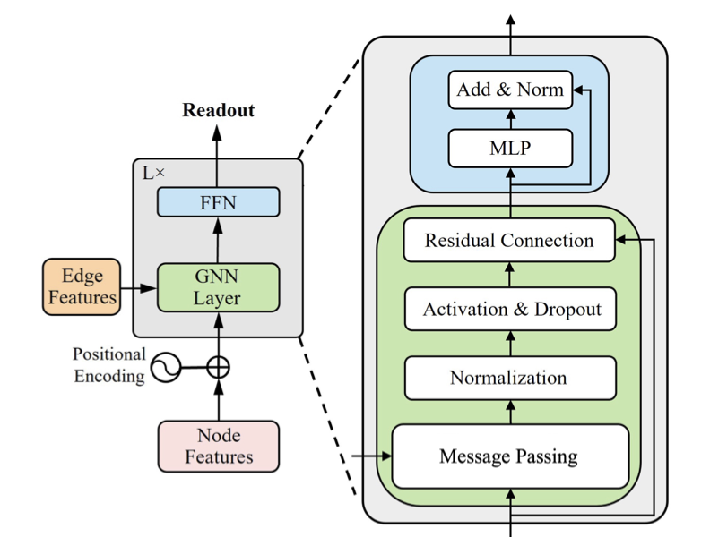

# Deep Learning Exam Hackathon: Graph Neural Networks for Noisy Label Learning

## Project Overview

This project presents our approach to the [Graph Learning with Noisy Labels Hackathon](https://sites.google.com/view/hackathongraphnoisylabels/home?authuser=0). Our solution addresses the challenge of training robust graph neural networks when dealing with corrupted node labels across four different datasets (A, B, C, and D).

## Architecture



Our implementation leverages the **Gated Graph Convolutional Network (GatedGCN)** architecture enhanced with GNNPlus methodology, following the research presented in [*Unlocking the Potential of Classic GNNs for Graph-level Tasks: Simple Architectures Meet Excellence (Luo et al., 2025)*](https://arxiv.org/pdf/2502.09263v1). The model employs gating mechanisms to selectively filter and combine neighbor information, making it particularly effective in noisy label scenarios.

## Configuration Details

We have optimized distinct hyperparameter configurations for each dataset to maximize performance under label noise conditions:

- **Datasets A, B, C**: Trained with the **GatedGCN** approach using different loss functions:
  - **Dataset A & C**: Generalized Cross-Entropy (GCE) loss with q=0.5
  - **Dataset B**: Generalized Cross-Entropy (GCE) loss with q=0.9
- **Dataset D**: Trained using the **GIN-Virtual** baseline model with GCE loss

## Setup Instructions

Ensure you have Python available on your system, then install the necessary packages:

```bash
pip install -r requirements.txt
```

## Running the Code

To execute training for any specific dataset, follow these steps:

Execute the training script with appropriate data paths:

```bash
python main.py --test_path <test_dataset_path> --train_path <training_dataset_path>
```

The system will automatically generate:
- **Model checkpoints** → `checkpoints/` folder
- **Training logs** → `logs/` folder  
- **Submissions** → `submission/` folder

**Note**: If no training path is provided, the script will automatically run inference using the best pre-trained checkpoint for the specified dataset.

## Additional Information

**Contributors**: Stefano D'Urso and Vincenzo Crisà

---

*This project was developed as part of the Deep Learning exam hackathon challenge.*
